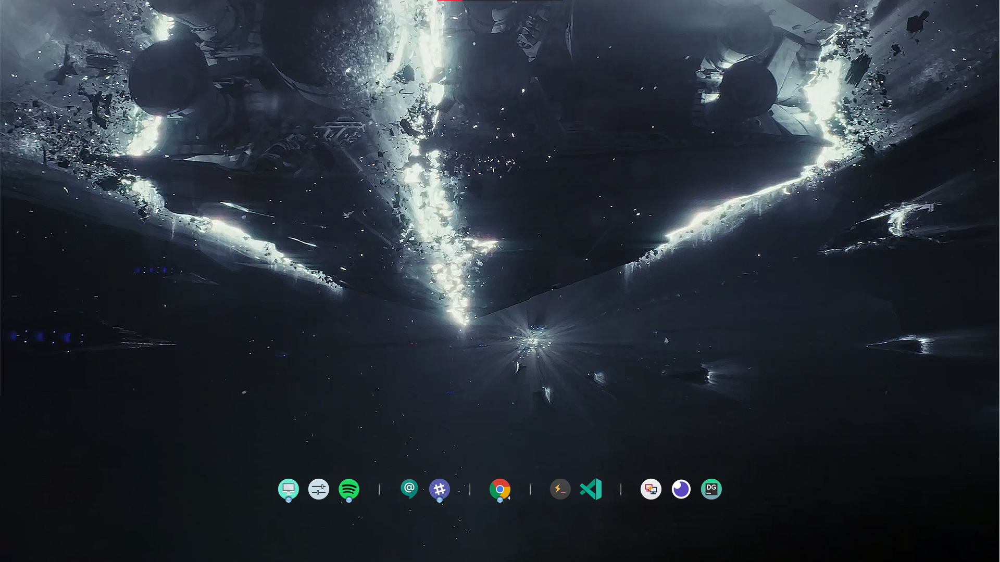

# Windows Theming

I use theming on Windows to personalize the look-and-feel of my computer.

## 1. Rainmaker

Install [Rainmaker](https://www.rainmeter.net/) to allow skinning of Windows.

## 2. Install Nexus Taskbar

Install [Winstep Nexus](https://www.winstep.net/nexus.asp) to provide a nice configurable dock.

You can view the `wsbackup.wbk` and alter it, and/or restore it for your use.

## 3. Custom Icons

I use the icons located [here](https://www.deviantart.com/niivu/art/Numix-Circle-For-Windows-708567015).